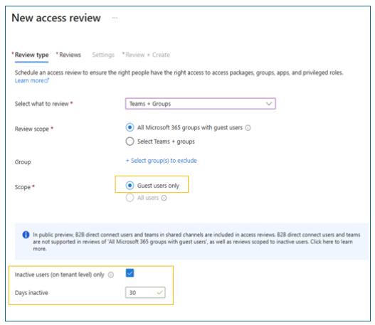
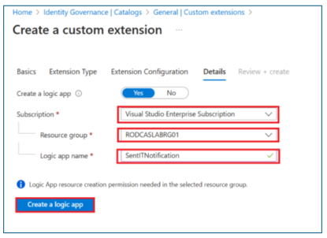
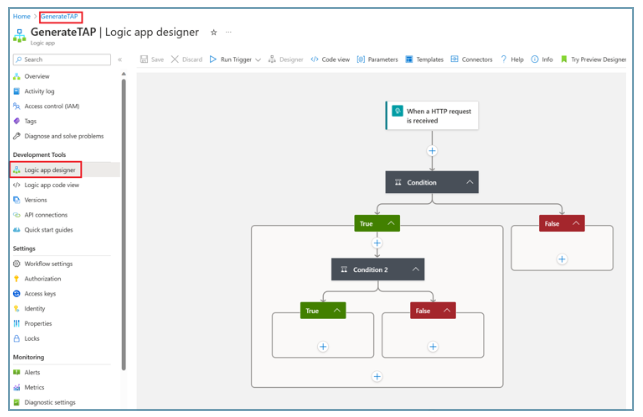
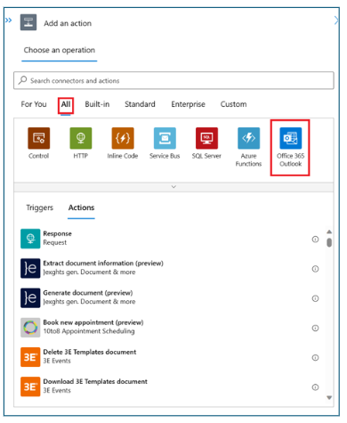
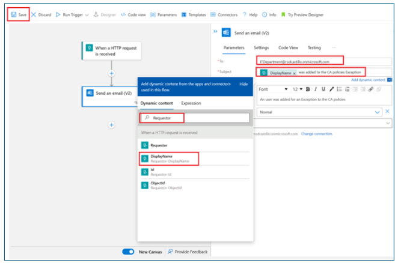

# Microsoft Entra ID Governance deployment guide to govern guest and partner access

Deployment scenarios are guidance on how to combine and test Microsoft Security products and services. You can discover how capabilities work together to improve productivity, strengthen security, also help you meet compliance and regulatory requirements. 

The following products and services appear in this guide:

* [Microsoft Entra ID Governance](../id-governance/identity-governance-overview.md)
* [Microsoft Entra ID](../fundamentals/whatis.yml)
* [Microsoft Entra](../fundamentals/what-is-entra.yml)
* [Entitlement management](../id-governance/entitlement-management-overview.md)
* [Azure Logic Apps](/azure/logic-apps/logic-apps-overview)
* [PIM for Groups](../id-governance/privileged-identity-management/concept-pim-for-groups.md)
* [Identity Governance dashboard](../id-governance/governance-dashboard.md)

Use this scenario to help determine the need for [Microsoft Entra ID Governance](../id-governance/identity-governance-overview.md) to create and grant access for your organization. Learn how to manage guest users in your environment. 

## PoC timeline

Timelines show approximate delivery stage duration and are based on scenario complexity.

* Onboarding and discovery - 2 hours
* Auto assign resources - 1 hour
* Custom workflows - 2 hours
* Convert external users - 1 hour
* Access review - 1 hour  

## Scenario requirements

To enable the scenario, ensure the following requirements are met: 

* [Microsoft Entra ID](../fundamentals/licensing.md) P1 or P2 license
* Microsoft Entra ID Governance SKU
  * Microsoft Logic Apps and auto assignment policies
* Two tenants, target and source
* A cloud user account on the target tenant to approve and access
* A cloud user on the source tenant to request access
* An account on the target tenant:
  * User Administrator,
  * Identity Governance Administrator,
  * Privileged Role Administrator, or
  * Global Administrator 

### B2B collaboration and guest users

To collaborate with guest users, you can let them use their preferred identity to sign in to your app or other enterprise apps: SaaS, custom-developed, etc. Typically, B2B collaboration users are in your directory as guest users.  

Learn more in the overview, [B2B collaboration with external guests for your workforce](../external-id/what-is-b2b.md). 

## Provision guest users in Microsoft Entra ID

Users can use Microsoft Entra [entitlement management](../id-governance/entitlement-management-overview.md) self-service features to sign up for access. Learn about [self-service sign-up](../external-id/self-service-sign-up-overview.md), and how to [manage external access with entitlement management](../architecture/6-secure-access-entitlement-managment.md).  

### Entitlement management or self-service signup

Use the following table to ease decision making.

|Entitlement management|Both|Self-service signup|
|---|---|---|
|- Requested with My Access portal or link   - Access packages   - Built-in approval workflows   - Scope requests by organization   - Lifecycle automation   - Supports Security Assertion Markup Language (SAML) and Web Service Federation (WS-Fed) identities|- Request triggered by end user   - Collect additional attributes   - Trigger custom logic apps and APIs   - Available to anyone   - Supports: Microsoft Entra ID, email one-time pass (OTP)|- Branded onboarding sign-in page   - Users create accounts at the app   - Language options   - Supports: Google, Microsoft Account (MSA), Facebook |

## Onboarding and discovery

With the [Microsoft Identity Governance dashboard](../id-governance/governance-dashboard.md), discover usage information about identity features configured in your tenant. See the current state of your environment, determine response actions, and find links to documentation. 

### External user insights

Over time, external user accounts are created in the Microsoft Entra tenant. When external users, or guests, stop accessing the tenant, the external user account becomes stale. 

You can [monitor and clean up stale guest access accounts using access reviews](../identity/users/clean-up-stale-guest-accounts.md).

### External user attribute management

Approvers allow or deny requests for access packages. To help Approvers make access decisions about onboarding external users, you can include custom questions in an access request flow. Store Requestor information for apps or other processes.  

## Entitlement management

Decentralized identity solutions enable individuals to control their digital identities and manage identity data without reliance on a centralized authority or intermediary. Reduce the need for new employees or business partners to perform self-attestation. Simplify approval processes and simplify your compliance posture. Learn more about [Microsoft Verified ID](../verified-id/decentralized-identifier-overview.md) in entitlement management. 

### External user assignments and access packages

When external users request initial access, they're invited to your directory and assigned access. In entitlement management, use access packages to assign access to multiple resources. Ensure access packages are in a container called a catalog, which has resources you can add to access package.  

* [Govern access for external users in entitlement management](/id-governance/entitlement-management-external-users)
* [Create an access package in entitlement management](/id-governance/entitlement-management-access-package-create)
* [View, add, and remove assignments for an access package](/id-governance/entitlement-management-access-package-assignments)

## Deploy PoC: External user access

1. [Add connected organization](/azure/active-directory/governance/entitlement-management-organization).
2. [Settings for external users](/azure/active-directory/governance/entitlement-management-external-users).
3. [Create an access package in entitlement management](/azure/active-directory/governance/entitlement-management-access-package-create).
4. [Change the Hidden setting](/azure/active-directory/governance/entitlement-management-access-package-edit).
5. [Create an access package with Verified ID requirements](/azure/active-directory/governance/entitlement-management-verified-id-settings).
6. [Assign users](/azure/active-directory/governance/entitlement-management-access-package-assignments).
7. [Share a link to request an access package in entitlement management](/azure/active-directory/governance/entitlement-management-access-package-settings).

For more detail, see [Govern access for external users in entitlement management](/id-governance/entitlement-management-external-users).

### Assign and remove resources

To learn how to assign access, remove it, and more PoC guidance, go to [Scenario 2: Assign employee access to resources](governance-deployment-employee-access.md).

### Custom workflows with Azure Logic Apps

To create and run automated workflows with [Azure Logic Apps](/azure/logic-apps/), learn about custom use cases and more, or go to [Scenario 2: Assign employee access to resources](governance-deployment-employee-access.md).  

## Manage the external user lifecycle

In entitlement management, external users have three states: governed, ungoverned, and blank. External users invited to your tenant are ungoverned. The ungoverned can lose their last access package assignment yet remain in the tenant indefinitely. To manage the lifecycle, convert the ungoverned to governed while they have access. 

Learn to [govern access for external users in entitlement management](/id-governance/entitlement-management-external-users). 

## Deploy PoC: Guest user lifecycle

* [Create an access package in entitlement management](/azure/active-directory/governance/entitlement-management-access-package-create)
* [Create an automatic assignment policy](/azure/active-directory/governance/entitlement-management-access-package-auto-assignment-policy)
* [Manage guest user lifecycle in the Microsoft Entra admin center](/azure/active-directory/governance/entitlement-management-access-package-manage-lifecycle)

### Access reviews

To learn to enable recurring access reviews, go to [Scenario 2: Assign employee access to resources](governance-deployment-employee-access.md). 

### Multistage reviews

Learn about multistage reviews that ease reviewer burdens, go to [Scenario 2: Assign employee access to resources](governance-deployment-employee-access.md).

### Inactive users

You can conduct inactive user reviews to discern stale accounts. To learn more, go to [Scenario 2: Assign employee access to resources](governance-deployment-employee-access.md). 

### User-to-Group Affiliation

The User-to-Group Affiliation feature helps you make access decisions based on machine-learning derived recommendations. To learn more, go to [Scenario 2: Assign employee access to resources](governance-deployment-employee-access.md).

### Guest user risk in Microsoft Teams and Microsoft 365 Groups

Access reviews include new groups with guest users and groups with recently added guests. Review recommendations are based on last sign-in details. As an option, denied guests are blocked from sign-in, then the account is deleted.  

Learn more :  

* [Guest access in Microsoft Teams](/microsoftteams/guest-access)
* [Manage guest access in Microsoft 365 Groups](/microsoft-365/admin/create-groups/manage-guest-access-in-groups?view=o365-worldwide&preserve-view=true)
* [Overview of Microsoft 365 Groups for Administrators](/microsoft-365/admin/create-groups/office-365-groups?view=o365-worldwide&preserve-view=true)
* [Microsoft 365 guest sharing settings reference](/microsoft-365/solutions/microsoft-365-guest-settings?view=o365-worldwide&preserve-view=true)

### Guest user access reviews

When conducting access reviews, you can review groups that have guest user members. Or you can review apps with assigned guest users. Guests are inactive after 30 days with no sign-in.  

The **New access review** dialog, with the **Review type** tab, and guest user options highlighted. 

   

### Access review history report

To learn more about downloadable review-history reports, see [Scenario 2: Assign employee access to resources](governance-deployment-employee-access.md).

## Deploy PoC: Access review guide

For PoC deployment instructions, go to [Scenario 2: Assign employee access to resources](governance-deployment-employee-access.md).

### (Sample) Use custom extensions with Azure Logic Apps and entitlement management

1. Sign in to the [Microsoft Entra admin center](https://entra.microsoft.com/) as, at least, an Identity Governance Administrator.
2. Browse to **Identity Governance**.
3. Select **Entitlement management**.
4. Select **Catalogs**.
5. In Catalogs, select the catalog for the custom extension.
6. In the left menu, select **Custom extensions**.
7. Select **Add custom extension**. 
8. For **Name**, type the custom extension name.
9. Select **Send**.
10. Select **Next**. 
11. On the **Extension type** tab, select **Next**.
12. On **Extension configuration**, select **Next**.
13. On the **Details** tab, select a subscription and resource group.
14. For **Logic app name**, type a name.
15. Select **Create a logic app**. 

   

16. The logic app is created.
17. Select **Review** and **Create**.
18. Select **Create**.

### Customize a logic app

1. Go to the [Azure portal](https://ms.portal.azure.com).
2. Browse to **Logic apps**.
3. Open **SendITNotification**.
4. In the left menu, select **Logic app designer**.

   

5. On **Condition**, right-click and select **Delete**.
6. An activity appears in Workflow designer.
7. In Workflow designer, select the plus sign (**+**).
8. Select **Add an action**.
9. Select the **All** tab.
10. Select **Office 365**.

   

11. On the **Actions** tab, select **Send an email (v2)**.
12. On **Send an email Action v2**, for **To**, type a name.
13. Select the subject text box.
14. On **Add dynamic content**, select the **Add dynamic content** link.
15. Search for Requestor.
16. Select **DisplayName**.
17. For **Body**, type **User added as an exception to Condtional Access policy**. 

   

18. Select **Save**.

## Next steps

  * [Introduction to Microsoft Entra ID Governance deployment guide](governance-deployment-intro.md)
  * [Scenario 1: Employee lifecycle automation](governance-deployment-employee-lifecycle.md)
  * [Scenario 2: Assign employee access to resources](governance-deployment-employee-access.md)
  * Scenario 3: Govern guest and partner access
  * [Scenario 4: Govern privileged identities and their access](governance-deployment-privileged-identities.md)
