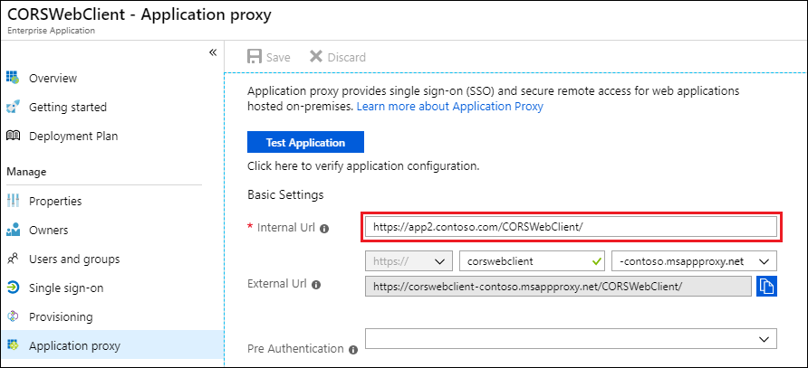
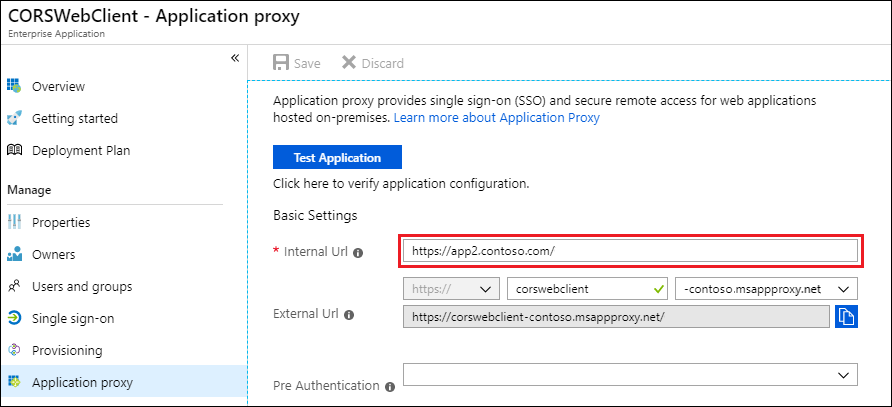

# Understand and solve Microsoft Entra application proxy cross-origin resource sharing (CORS) issues

[Cross-origin resource sharing (CORS)](https://www.w3.org/TR/cors/) can present challenges for the apps and APIs you publish through Microsoft Entra application proxy. This article discusses Microsoft Entra application proxy CORS issues and solutions.

> [!TIP]
> Asynchronous JavaScript and eXtensible Markup Language is known as (AJAX). AJAX contains an acronym within an acronym in that eXtensible Markup Language (XML) makes up the last `X` in AJAX. AJAX stands for Asynchronous JavaScript and XML and XML stands for eXtensible Markup Language.

Browser security usually prevents a web page from making requests to another domain. This restriction is called the *same-origin policy*, and prevents a malicious site from reading sensitive data from another site. However, sometimes you might want to let other sites call your web API. CORS is a W3C standard that lets a server relax the same-origin policy and allow some cross-origin requests while rejecting others.

## Understand and identify CORS issues

Two URLs have the same origin if they have identical schemes, hosts, and ports ([Request For Comments (RFC) 6454](https://tools.ietf.org/html/rfc6454)), such as:

-   `http://contoso.com/foo.html`
-   `http://contoso.com/bar.html`

These URLs have different origins than the previous two:

-   `http://contoso.net` - Different domain
-   `http://contoso.com:9000/foo.html` - Different port
-   `https://contoso.com/foo.html` - Different scheme
-   `http://www.contoso.com/foo.html` - Different subdomain

Same-origin policy prevents apps from accessing resources from other origins unless they use the correct access control headers. If the CORS headers are absent or incorrect, cross-origin requests fail. 

You can identify CORS issues by using browser debug tools:

1. Launch the browser and browse to the web app.
1. Press **F12** to bring up the debug console.
1. Try to reproduce the transaction, and review the console message. A CORS violation produces a console error about origin.

In the following screenshot, selecting the **Try It** button caused a CORS error message that `https://corswebclient-contoso.msappproxy.net` wasn't found in the `Access-Control-Allow-Origin` header.


## CORS challenges with application proxy

The following example shows a typical Microsoft Entra application proxy CORS scenario. The internal server hosts a **CORSWebService** web API controller, and a **CORSWebClient** that calls **CORSWebService**. There's an Asynchronous JavaScript and XML (AJAX) request from **CORSWebClient** to **CORSWebService**.


The **CORSWebClient** app works when you host it on-premises, but either fails to load or errors out when published through Microsoft Entra application proxy. If you published the **CORSWebClient** and **CORSWebService** apps separately as different apps through application proxy, the two apps are hosted at different domains. An AJAX request from **CORSWebClient** to **CORSWebService** is a cross-origin request, and it fails.


## Solutions for application proxy CORS issues

You can resolve the preceding CORS issue in any one of several ways.

### Option 1: Set up a custom domain

Use a Microsoft Entra application proxy [custom domain](how-to-configure-custom-domain.md) to publish from the same origin, without having to make any changes to app origins, code, or headers. 

### Option 2: Publish the parent directory

Publish the parent directory of both apps. This solution works especially well if you have only two apps on the web server. Instead of publishing each app separately, you can publish the common parent directory, which results in the same origin.

The examples show the Microsoft Entra application proxy pages for the **CORSWebClient** app. When the **Internal URL** is set to `contoso.com/CORSWebClient`, the app can't make successful requests to the `contoso.com/CORSWebService` directory, because they're cross-origin. 



Instead, set the **Internal URL** to publish the parent directory, which includes both the `CORSWebClient` and `CORSWebService` directories:



The resulting app URLs effectively resolve the CORS issue:

- `https://corswebclient-contoso.msappproxy.net/CORSWebService`
- `https://corswebclient-contoso.msappproxy.net/CORSWebClient`

### Option 3: Update HTTP headers

To match the origin request, add a custom HTTP response header on the web service. Websites running in Internet Information Services (IIS), use IIS Manager to modify the header.


The modification doesn't require any code changes. You can verify it in a Fiddler trace.

```
**Post the Header Addition**\
HTTP/1.1 200 OK\
Cache-Control: no-cache\
Pragma: no-cache\
Content-Type: text/plain; charset=utf-8\
Expires: -1\
Vary: Accept-Encoding\
Server: Microsoft-IIS/8.5 Microsoft-HTTPAPI/2.0\
**Access-Control-Allow-Origin: https://corswebclient-contoso.msappproxy.net**\
X-AspNet-Version: 4.0.30319\
X-Powered-By: ASP.NET\
Content-Length: 17
```

### Option 4: Modify the application

You can change your application to support CORS by adding the Access-Control-Allow-Origin header, with appropriate values. The way to add the header depends on the application's code language. Changing the code requires the most effort.

### Option 5: Extend the lifetime of the access token

Some CORS issues can't be resolved. For example, your application redirects to `login.microsoftonline.com` to authenticate, and the access token expires. The CORS call then fails. A workaround for this scenario is to extend the lifetime of the access token, to prevent it from expiring during a user’s session. For more information, see [Configurable token lifetimes in Microsoft Entra ID](~/identity-platform/configurable-token-lifetimes.md).

### Option 6: Complex application

For applications composed of multiple individual web applications where preflight (OPTIONS) requests are used, you can publish them using the complex application feature. For more information, see [Understand complex applications in Microsoft Entra application proxy](application-proxy-configure-complex-application.md).

## See also
- [Tutorial: Add an on-premises application for remote access through application proxy in Microsoft Entra ID](~/identity/app-proxy/application-proxy-add-on-premises-application.md) 
- [Plan a Microsoft Entra application proxy deployment](conceptual-deployment-plan.md) 
- [Remote access to on-premises applications through Microsoft Entra application proxy](overview-what-is-app-proxy.md)
