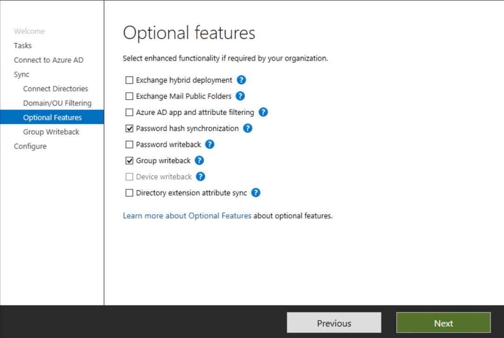

--
title: 'Group writeback for Microsoft 365 groups'
description: This article describes how to enable group writeback in Microsoft Entra Connect by using PowerShell and a wizard.

author: billmath
manager: amycolannino
ms.service: entra-id
ms.topic: how-to
ms.date: 11/06/2023
ms.subservice: hybrid-connect
ms.author: billmath


---

# Group writeback for Microsoft 365 groups

[!INCLUDE [deprecation](~/includes/gwb-v2-deprecation.md)]

Group writeback is a feature that allows you to write cloud groups back to your on-premises Active Directory instance by using Microsoft Entra Connect Sync. Group writeback V2 using Microsoft Entra Connect has been deprecated. Group writeback V1 using Microsoft Entra Connect still functions and should be used if you are synchronizing Microsoft 365 groups. This version of group writeback is being replaces with Microsoft Entra Connect Cloud Sync group provisioning to Active Directory. However, the V1 functionality will continue to work until Microsoft Entra Connect cloud sync supports synchronizing Microsoft 365 groups.

This article provides information and walks you through enabling group writeback V1. 

>[!IMPORTANT]
>This article describes how to enable group writeback V1 with Microsoft Entra Connect Sync. It should only be used by customers who provision Microsoft 365 groups to Active Directory.

 
## Prerequisites and information
The following pre-requisites must be met in order to enable group writeback.
- Azure Active Directory Premium licenses for your tenant.
- A configured hybrid deployment between your Exchange on-premises organization and Microsoft 365 and verified it's functioning correctly.
- Installed a supported version of Exchange on-premises
- Configured single sign-on using Azure Active Directory Connect

The following information should be taken into consideration when using group writeback V1 with Microsoft Entra Connect Sync:
- Microsoft 365 groups with up to 250,000 members can be written back to on-premises. 
- If you don't want to writeback all existing Microsoft 365 groups to Active Directory, you need to make changes to group writeback default behaviour before performing the steps in this article to enable the feature. See [Modify Microsoft 365 groups](#modifying-default-behavior-for-microsoft-365-groups).

## Enable group writeback

To enable group writeback, use the following steps:

1. Open the Azure AD Connect wizard, select **Configure** and then click **Next**.
2. Select **Customize synchronization options** and then click **Next**.
3. On the **Connect to Azure AD** page, enter your credentials. Click **Next**.
4. On the **Optional features** page, verify that the options you previously configured are still selected.
5. Select **Group writeback** and then click **Next**.
6. On the **Writeback page**, select an Active Directory organizational unit (OU) to store objects that are synchronized from Microsoft 365 to your on-premises organization, and then click **Next**.
7. On the **Ready** to configure page, click **Configure**.
8. When the wizard is complete, click **Exit** on the Configuration complete page.
9. Open the Windows PowerShell as an Administrator on the Microsoft Entra Connect server, and run the following commands.

```powershell
$AzureADConnectSWritebackAccountDN = <MSOL_ account DN>
Import-Module "C:\Program Files\Microsoft Azure Active Directory Connect\AdSyncConfig\AdSyncConfig.psm1"

# To grant the <MSOL_account> permission to all domains in the forest:
Set-ADSyncUnifiedGroupWritebackPermissions -ADConnectorAccountDN $AzureADConnectSWritebackAccountDN

# To grant the <MSOL_account> permission to specific OU (eg. the OU chosen to writeback Office 365 Groups to):
$GroupWritebackOU = <DN of OU where groups are to be written back to>
Set-ADSyncUnifiedGroupWritebackPermissions -ADConnectorAccountDN $AzureADConnectSWritebackAccountDN -ADObjectDN $GroupWritebackOU
```

For additional information on configuring the Microsoft 365 groups see [Configure Microsoft 365 Groups with on-premises Exchange hybrid](/exchange/hybrid-deployment/set-up-microsoft-365-groups#enable-group-writeback-in-azure-ad-connect).

## Disabling group writeback

To disable Group Writeback, use the following steps:

1. Launch the Azure Active Directory Connect wizard and navigate to the Additional Tasks page. Select the **Customize synchronization options** task and click **next**.
2. On the **Optional Features** page, uncheck group writeback. You will receive a warning letting you know that groups will be deleted. Click **Yes**.
  > [!IMPORTANT]
  > Disabling Group Writeback will cause any groups that were previously created by this feature to be deleted from your local Active Directory on the next synchronization cycle.

  

3. Click **Next**.
4. Click **Configure**.

 > [!NOTE]
 > Disabling Group Writeback will set the Full Import and Full Synchronization flags to 'true' on the Azure Active Directory Connector, causing the rule changes to propagate through on the next synchronization cycle, deleting the groups that were previously written back to your Active Directory.

 ## Modifying default behavior for Microsoft 365 groups
The following sections will provide guidance on how to modify the default behavior for Microsoft 365 groups.


### Write back Microsoft 365 groups with up to 250,000 members 

Because the default sync rule that limits the group size is created when group writeback is enabled, you must complete the following steps after you enable group writeback: 

1. On your Microsoft Entra Connect server, open a PowerShell prompt as an administrator. 
2. Disable the [Microsoft Entra Connect Sync scheduler](./how-to-connect-sync-feature-scheduler.md): 
 
  ``` PowerShell 
  Set-ADSyncScheduler -SyncCycleEnabled $false 
  ``` 
3. Open the [synchronization rule editor](./how-to-connect-create-custom-sync-rule.md). 
4. Set the direction to **Outbound**. 
5. Locate and disable the **Out to AD – Group Writeback Member Limit** synchronization rule. 
6. Enable the Microsoft Entra Connect Sync scheduler: 

  ``` PowerShell 
  Set-ADSyncScheduler -SyncCycleEnabled $true 
  ``` 

> [!NOTE] 
> Disabling the synchronization rule will set the flag for full synchronization to `true` on the Microsoft Entra connector. This change will cause the rule changes to propagate through on the next synchronization cycle. 

## Optional configuration 

To make it easier to find groups being written back from Microsoft Entra ID to Active Directory, there's an option to write back the group distinguished name by using the cloud display name: 

- Default format: 
`CN=Group_3a5c3221-c465-48c0-95b8-e9305786a271, OU=WritebackContainer, DC=domain, DC=com`  

- New format: 
`CN=Administrators_e9305786a271, OU=WritebackContainer, DC=domain, DC=com`  

When you're configuring group writeback, a checkbox appears at the bottom of the configuration window. Select it to enable this feature. 

> [!NOTE]
> Groups being written back from Microsoft Entra ID to Active Directory will have a source of authority in the cloud. Any changes made on-premises to groups that are written back from Microsoft Entra ID will be overwritten in the next sync cycle. 

## Next steps 

- [Microsoft Entra Connect group writeback](how-to-connect-group-writeback-v2.md) 


