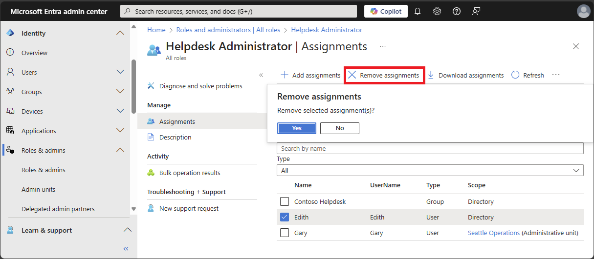

# Remove Microsoft Entra role assignments

This article describes how to remove Microsoft Entra role assignments using the Microsoft Entra admin center, Microsoft Graph PowerShell, or Microsoft Graph API.

In the Microsoft Entra admin center, you can remove both direct and indirect role assignments to a user. If a user is assigned a role by a group membership, remove the user from the group to remove the role assignment.

## Prerequisites

- Microsoft Entra ID P1 or P2 license
- Privileged Role Administrator
- Microsoft Graph PowerShell module when using PowerShell
- Admin consent when using Graph explorer for Microsoft Graph API

For more information, see [Prerequisites to use PowerShell or Graph Explorer](prerequisites.md).

## Remove Microsoft Entra role assignments

# [Admin center](#tab/admin-center)

[!INCLUDE [portal updates](~/includes/portal-update.md)]

1. Sign in to the [Microsoft Entra admin center](https://entra.microsoft.com) as at least a [Privileged Role Administrator](~/identity/role-based-access-control/permissions-reference.md#privileged-role-administrator).

1. Browse to **Identity** > **Roles & admins** > **Roles & admins**.

1. Select a *role name*.

1. Select the user or group from which you want to remove the role assignment and select **Remove assignment**.

   

1. When asked to confirm your action, select **Yes**.

# [PowerShell](#tab/ms-powershell)

Use the [Remove-MgRoleManagementDirectoryRoleAssignment](/powershell/module/microsoft.graph.identity.governance/remove-mgrolemanagementdirectoryroleassignment) command to remove role assignments.

```powershell
Remove-MgRoleManagementDirectoryRoleAssignment -UnifiedRoleAssignmentId $roleAssignment.Id
```

# [Graph API](#tab/ms-graph)

Use the [Delete unifiedRoleAssignment](/graph/api/unifiedroleassignment-delete) API to remove role assignments.

### Remove a role assignment for a user

```http
DELETE https://graph.microsoft.com/v1.0/roleManagement/directory/roleAssignments/lAPpYvVpN0KRkAEhdxReEJC2sEqbR_9Hr48lds9SGHI-1
```

Response

```http
HTTP/1.1 204 No Content
```

### Remove a role assignment that no longer exists

```http
DELETE https://graph.microsoft.com/v1.0/roleManagement/directory/roleAssignments/lAPpYvVpN0KRkAEhdxReEJC2sEqbR_9Hr48lds9SGHI-1
```

Response

```http
HTTP/1.1 404 Not Found
```

### Remove a Global Administrator role assignment for the current user

```http
DELETE https://graph.microsoft.com/v1.0/roleManagement/directory/roleAssignments/lAPpYvVpN0KRkAEhdxReEJC2sEqbR_9Hr48lds9SGHI-1
```

Response

```http
HTTP/1.1 400 Bad Request
{
    "odata.error":
    {
        "code":"Request_BadRequest",
        "message":
        {
            "lang":"en",
            "value":"Removing self from Global Administrator built-in role is not allowed"},
            "values":null
        }
    }
}
```

You are prevented from removing your own Global Administrator role assignment to avoid a scenario where a tenant has zero Global Administrators. Removing other roles assigned to yourself is allowed.

---

## Next steps

- [Use Microsoft Entra groups to manage role assignments](groups-concept.md)
- [Troubleshoot Microsoft Entra roles assigned to groups](groups-faq-troubleshooting.yml)
