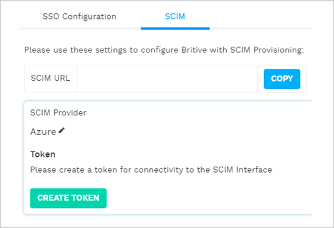
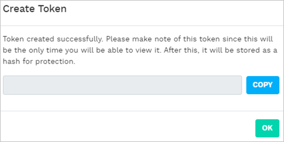

# Configure Britive for automatic user provisioning

This article describes the steps you need to perform in both Britive and Microsoft Entra ID to configure automatic user provisioning. When configured, Microsoft Entra ID automatically provisions and de-provisions users and groups to [Britive](https://www.britive.com/) using the Microsoft Entra provisioning service. For important details on what this service does, how it works, and frequently asked questions, see [Automate user provisioning and deprovisioning to SaaS applications with Microsoft Entra ID](~/identity/app-provisioning/user-provisioning.md). 

## Capabilities Supported
> [!div class="checklist"]
> * Create users in Britive
> * Remove users in Britive when they don't require access anymore
> * Keep user attributes synchronized between Microsoft Entra ID and Britive
> * Provision groups and group memberships in Britive
> * [Single sign-on](britive-tutorial.md) to Britive (recommended)

## Prerequisites

The scenario outlined in this article assumes that you already have the following prerequisites:

[!INCLUDE [common-prerequisites.md](~/identity/saas-apps/includes/common-prerequisites.md)]
* A [Britive](https://www.britive.com/) tenant.
* A user account in Britive with Admin permissions.

## Step 1: Plan your provisioning deployment
1. Learn about [how the provisioning service works](~/identity/app-provisioning/user-provisioning.md).
1. Determine who's in [scope for provisioning](~/identity/app-provisioning/define-conditional-rules-for-provisioning-user-accounts.md).
1. Determine what data to [map between Microsoft Entra ID and Britive](~/identity/app-provisioning/customize-application-attributes.md). 

## Step 2: Configure Britive to support provisioning with Microsoft Entra ID

The application has to be manually configured using the steps provided in the this section:
1. Login to Britive application with administrator privileges
1. Select **Admin->User Administration->Identity Providers**
1. Select **Add Identity Provider**. Enter the name and description. Select Add Identity Provider button.

	

1. A configuration page similar to one displayed below is shown.

	

1. Select **SCIM** tab. Change the SCIM provider from Generic to Azure and save the changes. Copy the SCIM URL and note it down. These values are entered in the **Tenant URL** boxes on the Provisioning tab of your Britive application.

	

1. Select **Create Token**. Select the validity of the token as required and select Create Token button.

	

1. Copy the token generated and note it down. Select OK. Note that the user isn't able to see the token again. Select Re-Create button to generate a new token if needed. These values are entered in the **Secret Token** and Tenant URL boxes on the Provisioning tab of your getAbstract application.

	 

## Step 3: Add Britive from the Microsoft Entra application gallery

Add Britive from the Microsoft Entra application gallery to start managing provisioning to Britive. If you have previously setup Britive for SSO, you can use the same application. However, we recommend that you create a separate app when testing out the integration initially. Learn more about adding an application from the gallery [here](~/identity/enterprise-apps/add-application-portal.md). 

## Step 4: Define who is in scope for provisioning 

[!INCLUDE [create-assign-users-provisioning.md](~/identity/saas-apps/includes/create-assign-users-provisioning.md)]

## Step 5: Configure automatic user provisioning to Britive 

This section guides you through the steps to configure the Microsoft Entra provisioning service to create, update, and disable users and/or groups in Britive based on user and/or group assignments in Microsoft Entra ID.

### To configure automatic user provisioning for Britive in Microsoft Entra ID:

1. Sign in to the [Microsoft Entra admin center](https://entra.microsoft.com) as at least a [Cloud Application Administrator](~/identity/role-based-access-control/permissions-reference.md#cloud-application-administrator).
1. Browse to **Identity** > **Applications** > **Enterprise applications**

	

1. In the applications list, select **Britive**.

	

1. Select the **Provisioning** tab.

	

1. Set the **Provisioning Mode** to **Automatic**.

	

1. Under the **Admin Credentials** section, input your Britive Tenant URL and Secret Token. Select **Test Connection** to ensure Microsoft Entra ID can connect to Britive. If the connection fails, ensure your Britive account has Admin permissions and try again.

 	

1. In the **Notification Email** field, enter the email address of a person or group who should receive the provisioning error notifications and select the **Send an email notification when a failure occurs** check box.

	

1. Select **Save**.

1. Under the **Mappings** section, select **Synchronize Microsoft Entra users to Britive**.

1. Review the user attributes that are synchronized from Microsoft Entra ID to Britive in the **Attribute-Mapping** section. The attributes selected as **Matching** properties are used to match the user accounts in Britive for update operations. If you choose to change the [matching target attribute](~/identity/app-provisioning/customize-application-attributes.md), you need to ensure that the Britive API supports filtering users based on that attribute. Select the **Save** button to commit any changes.

   |Attribute|Type|Supported for filtering|
   |---|---|---|
   |userName|String|&check;|
   |active|Boolean||
   |displayName|String||
   |title|String||
   |externalId|String||
   |preferredLanguage|String||
   |name.givenName|String||
   |name.familyName|String||
   |nickName|String||
   |userType|String||
   |locale|String||
   |timezone|String||
   |emails[type eq "home"].value|String||
   |emails[type eq "other"].value|String||
   |emails[type eq "work"].value|String||
   |phoneNumbers[type eq "home"].value|String||
   |phoneNumbers[type eq "other"].value|String||
   |phoneNumbers[type eq "pager"].value|String||
   |phoneNumbers[type eq "work"].value|String||
   |phoneNumbers[type eq "mobile"].value|String||
   |phoneNumbers[type eq "fax"].value|String||
   |addresses[type eq "work"].formatted|String||
   |addresses[type eq "work"].streetAddress|String||
   |addresses[type eq "work"].locality|String||
   |addresses[type eq "work"].region|String||
   |addresses[type eq "work"].postalCode|String||
   |addresses[type eq "work"].country|String||
   |addresses[type eq "home"].formatted|String||
   |addresses[type eq "home"].streetAddress|String||
   |addresses[type eq "home"].locality|String||
   |addresses[type eq "home"].region|String||
   |addresses[type eq "home"].postalCode|String||
   |addresses[type eq "home"].country|String||
   |addresses[type eq "other"].formatted|String||
   |addresses[type eq "other"].streetAddress|String||
   |addresses[type eq "other"].locality|String||
   |addresses[type eq "other"].region|String||
   |addresses[type eq "other"].postalCode|String||
   |addresses[type eq "other"].country|String||
   |urn:ietf:params:scim:schemas:extension:enterprise:2.0:User:employeeNumber|String||
   |urn:ietf:params:scim:schemas:extension:enterprise:2.0:User:costCenter|String||
   |urn:ietf:params:scim:schemas:extension:enterprise:2.0:User:organization|String||
   |urn:ietf:params:scim:schemas:extension:enterprise:2.0:User:division|String||
   |urn:ietf:params:scim:schemas:extension:enterprise:2.0:User:department|String||
   |urn:ietf:params:scim:schemas:extension:enterprise:2.0:User:manager|Reference||

1. Under the **Mappings** section, select **Synchronize Microsoft Entra groups to Britive**.

1. Review the group attributes that are synchronized from Microsoft Entra ID to Britive in the **Attribute-Mapping** section. The attributes selected as **Matching** properties are used to match the groups in Britive for update operations. Select the **Save** button to commit any changes.

      |Attribute|Type|Supported for filtering|
      |---|---|---|
      |displayName|String|&check;|
      |externalId|String||
      |members|Reference||

1. To configure scoping filters, refer to the following instructions provided in the [Scoping filter article](~/identity/app-provisioning/define-conditional-rules-for-provisioning-user-accounts.md).

1. To enable the Microsoft Entra provisioning service for Britive, change the **Provisioning Status** to **On** in the **Settings** section.

	

1. Define the users and/or groups that you would like to provision to Britive by choosing the desired values in **Scope** in the **Settings** section.

	

1. When you're ready to provision, select **Save**.

	

This operation starts the initial synchronization cycle of all users and groups defined in **Scope** in the **Settings** section. The initial cycle takes longer to perform than subsequent cycles, which occur approximately every 40 minutes as long as the Microsoft Entra provisioning service is running. 

## Step 6: Monitor your deployment

[!INCLUDE [monitor-deployment.md](~/identity/saas-apps/includes/monitor-deployment.md)]

## Additional resources

* [Managing user account provisioning for Enterprise Apps](~/identity/app-provisioning/configure-automatic-user-provisioning-portal.md)
* [What is application access and single sign-on with Microsoft Entra ID?](~/identity/enterprise-apps/what-is-single-sign-on.md)

## Related content

* [Learn how to review logs and get reports on provisioning activity](~/identity/app-provisioning/check-status-user-account-provisioning.md)
